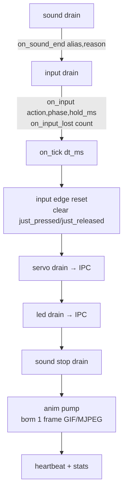

# Pika Engine — Tài liệu Module Firmware

> **Đối tượng:** Kỹ sư firmware bảo trì / mở rộng game engine.
> **Phạm vi:** Kiến trúc nội bộ của component C `game_engine` trên `head_esp32`.
> **Tài liệu kèm:** [Pika Engine — Guide](guide.md) · [API Reference](api.md) (dành cho người viết game pack bằng Lua).

Pika Engine là **runtime game viết bằng Lua 5.5.0** chạy trên `head_esp32`. Nó nhúng một Lua VM cô lập trong PSRAM, expose ~60 hàm Lua điều khiển ngoại vi robot (sprite/anim/text trên màn, speaker/servo/led/voice qua IPC sang `back_esp32`), nạp **game pack từ thẻ SD**, và chạy một game loop frame-based. Mọi lần vào Lua đều đi qua `lua_pcall` + message handler nên **script lỗi không bao giờ crash firmware**.

- Component: [head_esp32/components/game_engine/](../../head_esp32/components/game_engine/)
- Lua vendored: [head_esp32/components/lua-5.5.0/](../../head_esp32/components/lua-5.5.0/)
- API public: [game_engine.h](../../head_esp32/components/game_engine/include/game_engine.h)

---

## Mục lục

1. [Vị trí trong kiến trúc dual-MCU](#1-vị-trí-trong-kiến-trúc-dual-mcu)
2. [Cấu trúc thư mục component](#2-cấu-trúc-thư-mục-component)
3. [Vòng đời (lifecycle)](#3-vòng-đời-lifecycle)
4. [Engine task & game loop](#4-engine-task--game-loop)
5. [Subsystems — các SPSC ring & IPC bridge](#5-subsystems--các-spsc-ring--ipc-bridge)
6. [Bindings — chính sách C↔Lua](#6-bindings--chính-sách-clua)
7. [Lua VM — allocator, sandbox, watchdog](#7-lua-vm--allocator-sandbox-watchdog)
8. [Sandbox require()](#8-sandbox-require)
9. [Render](#9-render)
10. [Error model & diagnostics](#10-error-model--diagnostics)
11. [Kconfig & resource budget](#11-kconfig--resource-budget)
12. [Definition of Done khi sửa engine](#12-definition-of-done-khi-sửa-engine)

---

## 1. Vị trí trong kiến trúc dual-MCU

Game engine sống hoàn toàn trên **head**. Mọi ngoại vi do **back** điều khiển (servo, LED, voice, một phần audio) được engine gửi qua **IPC** — không bao giờ truy cập trực tiếp xuyên board (xem quy tắc IPC trong `docs/TECHNICAL_OVERVIEW.md`).

```
        head_esp32                                   back_esp32
┌──────────────────────────┐                  ┌──────────────────────┐
│  game_engine (Lua VM)     │                  │  servo / led / voice  │
│  ├ sprite/anim → LVGL ────┼─ màn hình        │  ├ ServoCmd executor   │
│  ├ Text       → LVGL      │                  │  ├ LED driver          │
│  ├ speaker ───┐           │  IPC (UART 921600)│  └ voice_session      │
│  ├ servo  ────┤           │◄────────────────►│                       │
│  ├ led    ────┤ ring→IPC  │  GPIO17/18        │  (input từ button)    │
│  └ voice  ────┘           │                  │                       │
└──────────────────────────┘                  └──────────────────────┘
   ▲ input event (button) đi back → head qua IPC, post vào input ring
```

Input (nút bấm) phát sinh ở **back**, forward qua IPC tới head, và được nạp vào engine bằng [`game_engine_post_input()`](../../head_esp32/components/game_engine/include/game_engine.h#L177).

---

## 2. Cấu trúc thư mục component

```
head_esp32/components/game_engine/
├── Kconfig                     # toàn bộ CONFIG_GAME_ENGINE_* / CONFIG_GAME_SOUND_*
├── CMakeLists.txt
├── include/                    # API public (main/ include được)
│   ├── game_engine.h           # lifecycle, input, voice, DI hooks, error/event
│   └── game_engine_audio.h     # bridge audio (chỉ sound_bridge.cpp dùng)
└── src/
    ├── core/
    │   ├── lua_vm.c            # tạo VM, allocator PSRAM, watchdog, sandbox, gọi hook
    │   ├── lua_require.c       # require("libs/...") sandbox + cache
    │   ├── engine_core.c       # engine_task, mailbox, game loop, stall detector
    │   ├── engine_host.c       # host event callback
    │   ├── game_pack.c         # nạp manifest.json + preload bảng, bootstrap script
    │   └── host_seams.c        # weak stub bridge (no-op khi main chưa nối)
    ├── bindings/               # 12 module binding C↔Lua (xem §6)
    ├── platform/
    │   └── save_store.c        # State.save/load (file save.sav, header PSV1)
    ├── render/
    │   ├── lvgl_renderer.c     # screen + sprite layer (LVGL, lazy init)
    │   ├── asset_loader.c      # nạp RGB565 / gọi hook decode PNG
    │   └── anim.c              # vòng đời GIF/MJPEG, bơm frame
    └── subsystems/             # 5 SPSC ring (xem §5)
        ├── input/  sound/  servo/  led/  voice/
```

---

## 3. Vòng đời (lifecycle)

```
game_engine_init(cb)               → tạo engine_task + mailbox
   │
   ├─ game_engine_start({game_id}) → đẩy ENG_MSG_START vào mailbox
   │      └ engine_task:
   │          game_pack_load(game_id)
   │            ├ đọc manifest.json (cJSON, cap 64KB)
   │            ├ preload input.actions / audio.sounds / servos+poses
   │            ├ snapshot volume người dùng
   │            ├ lua_vm_create_for_game()  (arena PSRAM + sandbox + 12 binding)
   │            ├ nạp + chạy entry_script (luaL_loadfilex "t" → docall)
   │            └ gọi hook game_start(level_json)
   │          → EVT_STARTED  (hoặc EVT_ERROR + game_engine_last_error())
   │
   │      [game loop chạy mỗi frame ~33ms — xem §4]
   │
   ├─ game_engine_request_home()   → ENG_MSG_HOME → gọi on_home(); false thì kết thúc
   ├─ game_engine_stop()           → ENG_MSG_STOP → game_end() → unload → EVT_GAME_END
   └─ game_engine_deinit()         → teardown engine_task, giải phóng ~32KB stack
```

API lifecycle đầy đủ (tất cả trả `esp_err_t` trừ getter):

| Hàm | Vai trò |
|---|---|
| [`game_engine_init(cb, user_data)`](../../head_esp32/components/game_engine/include/game_engine.h#L152) | Tạo task + mailbox. Idempotent (gọi lại chỉ refresh callback). |
| [`game_engine_deinit()`](../../head_esp32/components/game_engine/include/game_engine.h#L159) | Hủy task, free stack ~32KB internal SRAM. Đồng bộ, timeout ~2s. |
| [`game_engine_start(params)`](../../head_esp32/components/game_engine/include/game_engine.h#L163) | Nạp pack async; kết quả qua `EVT_STARTED`/`EVT_ERROR`. |
| [`game_engine_stop()`](../../head_esp32/components/game_engine/include/game_engine.h#L167) | Teardown game hiện tại (idempotent); `EVT_GAME_END`. |
| [`game_engine_request_home()`](../../head_esp32/components/game_engine/include/game_engine.h#L173) | HOME ngắn → `on_home()`. Trả true thì game tiếp tục. |
| [`game_engine_post_input(ev)`](../../head_esp32/components/game_engine/include/game_engine.h#L177) | Đẩy input event vào ring (non-blocking, copy by value). |
| [`game_engine_handle_voice_event(json, len)`](../../head_esp32/components/game_engine/include/game_engine.h#L189) | Deep-copy frame voice → mailbox → `on_voice_event`. |
| `game_engine_is_running()` / `current_game_id()` | Query trạng thái. |

`game_engine_start_params_t`: `game_id` (bắt buộc), `level_override` (reserved, có thể NULL), `from_talk_flow` (resume Talk flow khi game kết thúc). Chuỗi được copy trước khi hàm trả về.

---

## 4. Engine task & game loop

[engine_core.c](../../head_esp32/components/game_engine/src/core/engine_core.c) — `engine_task`:

| Thông số | Giá trị | Nguồn |
|---|---|---|
| CPU core | 1 | `CONFIG_GAME_ENGINE_TASK_CORE` |
| Priority | 5 (giữa LVGL=6 và GIF=3) | `CONFIG_GAME_ENGINE_TASK_PRIO` |
| Stack | 32 KB internal SRAM | `CONFIG_GAME_ENGINE_TASK_STACK` |
| Mailbox | `xQueueCreate(16, ...)` | engine_core.c |
| Nhịp khi chạy | `1000 / CONFIG_GAME_ENGINE_TARGET_FPS` ms = 33ms @30FPS | Kconfig |
| Nhịp khi idle | block mailbox 1000ms | engine_core.c |

### Mailbox message types

| Type | Payload | Hành động |
|---|---|---|
| `ENG_MSG_START` | game_id (dup) | `game_pack_load` → `game_start` → `EVT_STARTED`/`EVT_ERROR` |
| `ENG_MSG_STOP` | — | `game_end` → unload → `EVT_GAME_END` |
| `ENG_MSG_HOME` | — | `on_home()`; false → teardown + `EVT_GAME_END` |
| `ENG_MSG_VOICE_EVENT` | JSON (dup) | route → `on_voice_event` |
| `ENG_MSG_RELOAD` | — | rescan pack |
| `ENG_MSG_DEINIT` | — | teardown, task tự xóa |

### Thứ tự thực thi mỗi frame (game đang chạy)



**Quan trọng:** `on_input` chạy **trước** `on_tick` trong cùng frame; edge flags (`just_pressed`/`just_released`) chỉ được reset **sau** `on_tick` nên cả hai hook đều thấy edge nhất quán ([engine_core.c](../../head_esp32/components/game_engine/src/core/engine_core.c)). Các bước drain servo/led/sound-stop/anim là **non-fatal** (đếm lỗi, game vẫn chạy); lỗi trong `on_sound_end`/`on_input`/`on_tick` thì **kết thúc game** + `EVT_ERROR`.

### Stall detector

`CONFIG_GAME_ENGINE_STALL_DETECT_SEC` (mặc định 5s, 0 = tắt). Một `esp_timer` chạy ~1Hz kiểm `(now_us - last_tick_us) > budget`. Khi trip: set lỗi, teardown, `EVT_ERROR`. Mục đích bắt **deadlock trong C-binding** mà Lua watchdog không thấy (vd binding chặn ở stop audio đồng bộ). Log kèm `game_id`, `last_tick_ms`, `binding_name`, `binding_age_ms`, heap stats.

---

## 5. Subsystems — các SPSC ring & IPC bridge

Mỗi subsystem là một **ring single-producer single-consumer**; `engine_task` là consumer chung, drain ở đầu/cuối mỗi frame. Không dùng mutex trong vòng nóng (chỉ atomic head/tail).

| Subsystem | File | Producer | Ring size | Ghi chú |
|---|---|---|---|---|
| input | [input/input.c](../../head_esp32/components/game_engine/src/subsystems/input/input.c) | IPC RX task (back→head) | 32 | overflow → `on_input_lost`; map action theo manifest |
| sound | [sound/sound.c](../../head_esp32/components/game_engine/src/subsystems/sound/sound.c) | AudioManager event task + engine (synth) | 8 (luỹ thừa 2) | finish ring; cooldown 80ms; overflow → `on_sound_lost` |
| servo | [servo/servo.c](../../head_esp32/components/game_engine/src/subsystems/servo/servo.c) | Lua binding | 32 | coalesce theo hw_id; drain → IPC ServoCmd |
| led | [led/led_pump.c](../../head_esp32/components/game_engine/src/subsystems/led/led_pump.c) | engine_task (1 task) | — | fire-and-forget → IPC; head giữ mirror brightness |
| voice | [voice/voice_router.c](../../head_esp32/components/game_engine/src/subsystems/voice/voice_router.c) | mailbox (IPC frame) | — | JSON frame → `on_voice_event` (Lua table/raw string) |

### Sound — mapping reason (đã verify)

Giá trị truyền vào `on_sound_end(alias, reason)` là `(int)ev.reason` ([sound.c:671](../../head_esp32/components/game_engine/src/subsystems/sound/sound.c#L671)), khớp **byte-for-byte** với `Speaker.REASON_*` ([game_engine_audio.h:41-46](../../head_esp32/components/game_engine/include/game_engine_audio.h#L41-L46)):

| Hằng | Giá trị | Ý nghĩa |
|---|---|---|
| `GAME_ENGINE_SOUND_REASON_COMPLETED` | 0 | EOF tự nhiên |
| `GAME_ENGINE_SOUND_REASON_STOPPED` | 1 | `Speaker.stop` (engine synth, AudioManager không phát STOPPED) |
| `GAME_ENGINE_SOUND_REASON_PREEMPTED` | 2 | bị play mới thay thế |
| `GAME_ENGINE_SOUND_REASON_ERROR` | 3 | lỗi decode / I/O |

> STOPPED và PREEMPTED do engine **tự tổng hợp** (synth) vì AudioManager chỉ phát COMPLETED/ERROR. Thứ tự stop-all phải chạy synth-finish trước để Lua vẫn thấy `on_sound_end` cho alias hiện tại.

### Servo — IPC command

`game_servo_drain()` đẩy lệnh dạng 12-byte (khớp `ServoCmdMsg` của back) qua IPC. hw_id: `0=head, 1=base, 2=left, 3=right` ([servo_internal.h](../../head_esp32/components/game_engine/src/subsystems/servo/servo.c)). Easing: `linear=0, in_out=1, bounce=2`. `Servo.is_busy()` chỉ là **dự đoán cục bộ** (so `now` vs `expected_end_us`), không phải ACK phần cứng.

---

## 6. Bindings — chính sách C↔Lua

[bindings.h](../../head_esp32/components/game_engine/src/bindings/bindings.h) là nơi khai báo **duy nhất** mọi `game_bind_<module>_register()` (MISRA C:2012 Rule 8.4). Thứ tự đăng ký cố định trong `lua_vm.c` trước khi nạp bất kỳ chunk untrusted:

```
log → state → timer → engine → input → sprite → hud → anim
   → speaker → servo → led → voice
```

### Ba "camp" validation (chọn đúng 1 cho mỗi module, không trộn)

| Camp | Module | Quy tắc đối số sai |
|---|---|---|
| **STRICT** (raise) | state, input, text, sprite (mutator), anim, voice | `luaL_check*` → raise (pcall bắt, firmware an toàn) |
| **MUTATOR-TOLERANT** (trả false) | speaker, servo, led (ngoại vi IPC async) | `lua_is*` → trả `false`, không corrupt |
| **NO-OP** (không validate) | log (print), timer (millis), engine (getter) | đối số tầm thường |

**FACTORY pattern** (mọi camp): factory cấp phát trả `userdata` hoặc `(nil, "msg")` khi lỗi — **không bao giờ raise khi OOM** để script fallback được. Áp dụng: `Sprite.image`, `Sprite.solid`, `Anim.new`, `Text.new`.

### Invariant bắt buộc khi thêm binding mới

- **Không** gọi `lua_call`/`lua_callk`/`lua_resume` trực tiếp — mọi callback vào Lua đi qua `docall()` trong [lua_vm.c](../../head_esp32/components/game_engine/src/core/lua_vm.c) (msgh + traceback). PR-gate grep phải = 0 hit.
- Mọi cấp phát động dùng `heap_caps_*` với `MALLOC_CAP_SPIRAM`; cấm `malloc()` (internal SRAM) trong binding.
- `luaL_loadbufferx`/`luaL_loadfilex` phải mode `"t"` (chỉ text, từ chối bytecode biên dịch sẵn).
- Không binding nào được expose `io.*`/`os.*`/`package.*`/`debug.*`/`load`/`loadstring`/`loadfile`/`dofile`/`require`.
- Mỗi hàm C-Lua **phải** có 1 dòng comment ghi rõ số lượng trả về + convention (style: `docs/standards/pika-engine-binding-style.md`).

### Banned API Lua 5.5.0 (PR-gate grep)

- `lua_pushexternalstring` — string nền bằng internal SRAM cho phép script giữ internal heap → gây thiếu RAM cho Wi-Fi/LwIP (vi phạm PSRAM-only).
- `lua_gc(L, LUA_GCPARAM, ...)` — chỉnh GC suy đoán làm hồi quy frame-budget.
- Redefine `LUA_USER_H` / `LUA_EXTRASPACE` / `LUAI_NUMSTACKS`.

> Danh sách API Lua đầy đủ mà game gọi được nằm trong [API Reference](api.md#tham-chiếu-api-lua).

---

## 7. Lua VM — allocator, sandbox, watchdog

[lua_vm.c](../../head_esp32/components/game_engine/src/core/lua_vm.c) — `lua_vm_create_for_game()`:

### Allocator PSRAM-only (budget cứng)

`lua_psram_alloc()` ([lua_vm.c](../../head_esp32/components/game_engine/src/core/lua_vm.c)):

- Cấp **một arena PSRAM liền khối** kích thước `CONFIG_GAME_ENGINE_LUA_HEAP_KB` (mặc định 512KB), đặt một `multi_heap` lên đó → cô lập hàng nghìn alloc nhỏ của Lua khỏi asset buffer dài hạn. Nếu cấp arena thất bại → fallback về shared PSRAM heap.
- **Chỉ PSRAM, không fallback internal SRAM** — bảo vệ Wi-Fi/LwIP reserve. Vượt budget/PSRAM → trả `NULL` → Lua raise `LUA_ERRMEM` trong pcall hiện tại (gắn `GAME_ENGINE_ERR_OOM`).
- Cảnh báo high-water tại **90% budget** → phát `GAME_ENGINE_EVT_MEM_FALLBACK` (1 lần/phiên). Tên event giữ vì ABI nhưng nay nghĩa là "PSRAM budget gần cạn", không phải "đã fallback internal".

### Sandbox

- Mở thư viện an toàn: `base`, `table`, `string`, `math`, `utf8`.
- Vô hiệu hóa (gán `nil`) các global nạp code: `load`, `loadfile`, `dofile`.
- Không mở: `io`, `os`, `package`, `debug`.
- Cài message handler (traceback) + `require` tùy biến (§8) + tạo bảng `pika` rỗng.
- Hash seed từ `esp_timer_get_time()` chống HashDoS.

### Watchdog

| Cơ chế | Giá trị |
|---|---|
| Hook mỗi N instruction | `CONFIG_GAME_ENGINE_LUA_WATCHDOG_HOOK_COUNT` = 1000 (~100-200µs @240MHz) |
| Ngân sách wall-clock / pcall | `CONFIG_GAME_ENGINE_LUA_WATCHDOG_US` = 1.5s |
| Trip | `luaL_error` (longjmp) → `GAME_ENGINE_ERR_LUA_WATCHDOG` → `EVT_ERROR` |
| Reset | mỗi pcall (game_start, on_tick, on_input, on_sound_end, game_end, top-level load) |

---

## 8. Sandbox require()

[lua_require.c](../../head_esp32/components/game_engine/src/core/lua_require.c) — chỉ chấp nhận **một dạng duy nhất**:

```lua
local m = require("libs/<module>")   -- → /sd/games/<game_id>/libs/<module>.lua
```

- Prefix bắt buộc `libs/`; phần còn lại phải là safe relative path (chặn `..`, `/`, `\`, `:`, control char).
- Cache trong registry `_game_require_cache`, lifetime = 1 phiên game (xóa trước khi destroy VM).
- Lỗi nạp/chạy → `luaL_error` (abort pcall hiện tại, không fallback).

---

## 9. Render

[lvgl_renderer.c](../../head_esp32/components/game_engine/src/render/lvgl_renderer.c):

- **Lazy screen:** màn game chỉ tạo khi `Sprite.*`/`Anim.*` đầu tiên hoặc khi vào game screen (vì `game_engine_init` chạy *trước* LVGL).
- Mọi call LVGL bọc `lv_lock()`/`lv_unlock()` (recursive mutex, chung với LVGL timer task). ⚠️ Xem cảnh báo `lv_lock`/`lv_async_call` trong `project-context.md` — không gọi LVGL API từ task khác mà không hold lock.
- `game_sprite_t`: `lv_obj_t* img`, `lv_image_dsc_t dsc`, `void* pixels` (PSRAM, engine sở hữu & free), flip state, pending/hidden flags. Có `__gc` + `__close` (idempotent).

**Asset/codec đều dependency-injected từ main** (component không kéo codec):

| Hook | Inject bởi | Hợp đồng |
|---|---|---|
| [`game_engine_set_script_validator`](../../head_esp32/components/game_engine/include/game_engine.h#L262) | FileValidator (CRC) | success → buffer `heap_caps_malloc`; reject → non-OK, không fallback |
| [`game_engine_set_asset_opener`](../../head_esp32/components/game_engine/include/game_engine.h#L273) | FileValidator (spot-CRC) | trả `FILE*` mở sẵn offset 0 + size; reject → NULL |
| [`game_engine_set_png_decoder`](../../head_esp32/components/game_engine/include/game_engine.h#L287) | PNG codec | PNG bytes → RGB565 PSRAM + w/h; lỗi → `Sprite.image` trả (nil,msg) |
| [`game_engine_set_anim_codec`](../../head_esp32/components/game_engine/include/game_engine.h#L328) | AnimatedGIF / esp_jpeg | open/next/reset/close; engine giữ file buffer PSRAM, codec **không** free |

Frame anim là native-endian RGB565 (LE) đưa thẳng vào LVGL không cần convert; `next()` trả dirty sub-rect để engine chỉ copy vùng đổi dưới `lv_lock`.

---

## 10. Error model & diagnostics

Hai kênh lỗi: async `GAME_ENGINE_EVT_ERROR` + subcode đọc bằng `game_engine_last_error()`.

### Events ([game_engine.h:22-36](../../head_esp32/components/game_engine/include/game_engine.h#L22-L36))

`EVT_STARTED`, `EVT_GAME_END`, `EVT_ERROR`, `EVT_MEM_FALLBACK`.

### Error subcodes ([game_engine.h:44-54](../../head_esp32/components/game_engine/include/game_engine.h#L44-L54))

| Subcode | Khi nào |
|---|---|
| `GAME_ENGINE_ERR_PACK_NOT_FOUND` | manifest thiếu/không đọc được |
| `GAME_ENGINE_ERR_PACK_MANIFEST` | manifest JSON sai (kể cả bảng input/audio/servo malform) |
| `GAME_ENGINE_ERR_LUA_VM_CREATE` | `lua_newstate`/sandbox thất bại |
| `GAME_ENGINE_ERR_LUA_LOAD` | `luaL_loadfilex` parse error |
| `GAME_ENGINE_ERR_LUA_RUNTIME` | pcall lỗi trong game_start/on_tick/... |
| `GAME_ENGINE_ERR_LUA_WATCHDOG` | Lua vượt watchdog (hoặc stall detector) |
| `GAME_ENGINE_ERR_OOM` | allocator budget / PSRAM cạn |

### Diagnostics

- `game_engine_last_error()` / `game_engine_last_error_message()` (kèm Lua traceback cho LUA_*).
- `game_engine_input_stats()` → `{events_total, events_delta, dropped_total, seq_gaps}`.
- `game_engine_sound_stats()` → `{played_total, finish_dropped, error_count, cooldown_reject, speaker_abandoned_current/peak}`.

---

## 11. Kconfig & resource budget

Toàn bộ tại [Kconfig](../../head_esp32/components/game_engine/Kconfig). Các giá trị quan trọng:

| Config | Default | Range | Ý nghĩa |
|---|---|---|---|
| `GAME_ENGINE_ENABLED` | y | — | Gate compile/link component |
| `GAME_ENGINE_TASK_CORE` | 1 | 0–1 | Core pin engine_task |
| `GAME_ENGINE_TASK_PRIO` | 5 | 1–10 | Priority (giữa LVGL=6, GIF=3) |
| `GAME_ENGINE_TASK_STACK` | 32768 | — | Stack (bytes) |
| `GAME_ENGINE_TARGET_FPS` | 30 | 15–60 | Nhịp `on_tick` |
| `GAME_ENGINE_MAX_SPRITES` | 32 | — | Trần Sprite.* (vượt → nil) |
| `GAME_ENGINE_LUA_HEAP_KB` | 512 | 128–2048 | Budget Lua (PSRAM-only) |
| `GAME_ENGINE_LUA_WATCHDOG_US` | 1500000 | 100k–10M | Trần µs/pcall |
| `GAME_ENGINE_LUA_WATCHDOG_HOOK_COUNT` | 1000 | 100–100k | Instruction giữa 2 lần kiểm |
| `GAME_ENGINE_GAMES_ROOT` | `/sd/games` | — | Gốc game pack trên SD |
| `GAME_ENGINE_SAVE_MAX_BYTES` | 4096 | 256–65536 | Trần `State.save` |
| `GAME_ENGINE_STALL_DETECT_SEC` | 5 | 0–60 | Stall detector (0=tắt) |
| `GAME_SOUND_FINISH_RING_SIZE` | 8 | 4–64 | Ring finish (luỹ thừa 2) |
| `GAME_SOUND_PLAY_COOLDOWN_MS` | 80 | 0–2000 | Cooldown `Speaker.play` |
| `GAME_INFLIGHT_MUTEX_TIMEOUT_MS` | 200 | 10–5000 | Tripwire deadlock map rid→alias |

**Budget nguyên tắc:** buffer lớn (sprite/anim/font) → PSRAM; stack task + DMA → internal. Lua **không bao giờ** dùng internal SRAM. Trần asset (từ `engine_internal.h`): ảnh tối đa 480×320, PNG ≤1MB, anim ≤4MB & frame ≥10ms, font ≤512KB & ≤4 face cache, size 8–96px.

---

## 12. Definition of Done khi sửa engine

- [ ] `idf.py build` sạch trên `head_esp32`, không warning mới.
- [ ] Binding mới: đúng 1 camp validation + comment return-convention + dùng `heap_caps` SPIRAM.
- [ ] Mọi callback vào Lua qua `docall()` (PR-gate grep = 0 hit `lua_call`/`lua_resume` trực tiếp).
- [ ] Không expose API banned / stdlib nguy hiểm.
- [ ] Đổi manifest schema / binding / public API → cập nhật [Guide](guide.md) / [API Reference](api.md).
- [ ] Đổi format IPC servo/led/voice → cập nhật cả 2 board + version check.
- [ ] Đo `uxTaskGetStackHighWaterMark` nếu chạm đường binding sâu.

---

_Khớp code tại nhánh `feat/game_engine`. Chính sách version & quy tắc bump: xem [README](README.md). Khi đổi behavior public, cập nhật cả [Guide](guide.md) / [API Reference](api.md)._
